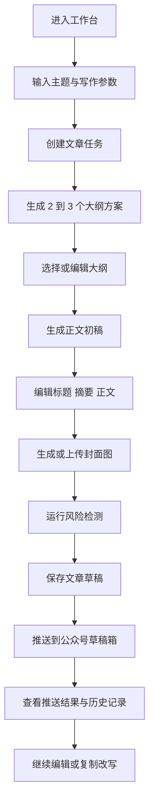

## 1. 产品概述
个人版 `公众号 AI 发文助手` 是一个单用户 Web 工具，帮助创作者把“想到主题”快速转成“可进入公众号草稿箱的图文内容”。
- 核心问题：公众号发文链路长，包含选题、大纲、正文、配图、编辑、检测、发布，人工重复操作多且容易中断。
- 目标用户：个人创作者、独立博主、自媒体运营者，当前阶段仅服务单一使用者本人。
- 产品价值：把公众号发文流程压缩为一条可复用工作流，提升稳定产出效率，减少从零写稿和来回复制粘贴的成本。

## 2. 核心功能
### 2.1 用户角色
当前版本为单用户产品，不区分角色权限。

### 2.2 功能模块
1. **工作台**：输入主题、设置写作参数、创建文章任务、查看最近文章。
2. **大纲确认页**：生成多个大纲方案、选择方案、微调结构。
3. **文章编辑页**：生成正文、编辑标题摘要正文、生成封面图、运行风险检测、推送草稿箱。
4. **历史记录页**：查看历史草稿、继续编辑、复制改写、重新推送。
5. **设置页**：配置公众号凭证、AI 模型参数、默认写作模板和敏感词列表。

### 2.3 页面详情
| 页面名称 | 模块名称 | 功能描述 |
|-----------|-----------|-----------|
| 工作台 | 主题输入区 | 输入主题、关键词、风格、目标读者、目标、字数，创建文章任务 |
| 工作台 | 最近文章区 | 展示最近生成的文章，支持继续编辑 |
| 大纲确认页 | 参数摘要卡片 | 展示当前主题、风格、目标读者、预估字数 |
| 大纲确认页 | 大纲方案列表 | 一次展示 2 到 3 个大纲方案，支持选择、重生成、手动调整 |
| 文章编辑页 | 标题摘要区 | 编辑主标题、摘要、封面短文案，生成备选标题 |
| 文章编辑页 | 正文编辑区 | 展示并编辑 AI 生成正文，支持保存草稿和后续扩写 |
| 文章编辑页 | 配图工具区 | 生成封面图、上传替换图片、管理图片素材 |
| 文章编辑页 | 风险检测区 | 检测敏感词、夸张标题、冗长段落并输出修改建议 |
| 文章编辑页 | 发布区 | 推送到公众号草稿箱，显示推送状态和错误信息 |
| 历史记录页 | 文章列表 | 按时间展示历史文章及状态，支持复制改写和重新推送 |
| 设置页 | 公众号配置 | 维护 `AppID`、`AppSecret` 等接入信息 |
| 设置页 | AI 配置 | 维护文本模型、图片模型、默认风格和默认字数 |
| 设置页 | 敏感词配置 | 维护自定义风险词和内容提醒规则 |

## 3. 核心流程
用户从工作台输入主题并配置文章参数，系统先生成多个大纲供用户选择；用户选定结构后触发正文生成，并在编辑页中完成标题、摘要、正文和封面图调整。文章保存后可运行风险检测，再一键推送到公众号草稿箱，最后在历史记录中继续复用或再次发布。

## 4. 用户界面设计
### 4.1 设计风格
- 主色：深墨黑 `#121212`，用于主要操作按钮和导航标题。
- 辅色：米白 `#F6F1E8`，用于页面背景，降低工具感，提升内容创作氛围。
- 强调色：青蓝 `#3E7BFA` 与金橙 `#E7A93B`，分别用于 AI 动作按钮与发布状态反馈。
- 按钮风格：圆角矩形按钮，主按钮高对比、次按钮浅描边，强调“创作工作台”而非营销站视觉。
- 字体建议：中文标题使用有编辑感的宋黑风格字体，正文字体使用清晰耐读的现代无衬线字体。
- 布局风格：桌面优先的双栏创作布局，左侧内容编辑，右侧操作与状态面板。
- 图标风格：简洁线性图标，避免过度拟物；重点按钮配合轻量动画提示处理进度。

### 4.2 页面设计概览
| 页面名称 | 模块名称 | UI 元素 |
|-----------|-----------|-----------|
| 工作台 | 主题输入区 | 大输入框、风格选择器、字数选择器、最近操作提示 |
| 工作台 | 最近文章区 | 卡片式列表、状态标签、更新时间、继续编辑按钮 |
| 大纲确认页 | 大纲方案卡片 | 标题、定位说明、章节清单、选中态高亮边框 |
| 文章编辑页 | 标题摘要区 | 输入框、标签、快捷生成按钮、状态提示 |
| 文章编辑页 | 正文编辑区 | 大尺寸文本编辑器、段落工具条、保存状态反馈 |
| 文章编辑页 | 侧边工具栏 | AI 操作按钮组、检测结果卡片、发布状态卡片 |
| 历史记录页 | 文章列表 | 表格或卡片混合布局、筛选栏、状态颜色标识 |
| 设置页 | 配置表单 | 分组卡片、密码型字段、保存成功提示 |

### 4.3 响应式策略
- 采用桌面优先设计，优先保证 `1440px` 到 `1920px` 宽度下的创作效率。
- 平板端保留双栏，但右侧工具栏折叠为顶部标签切换。
- 移动端仅作为查看与轻编辑入口，不作为主要创作场景。
- 所有操作按钮需保证足够点击面积，编辑区在窄屏下优先纵向展开。
