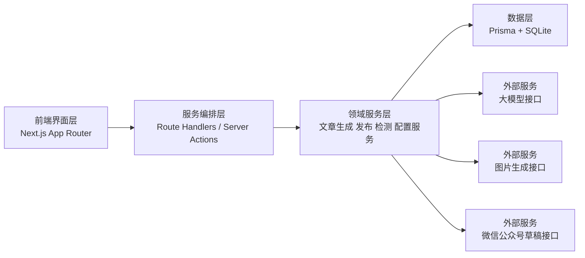
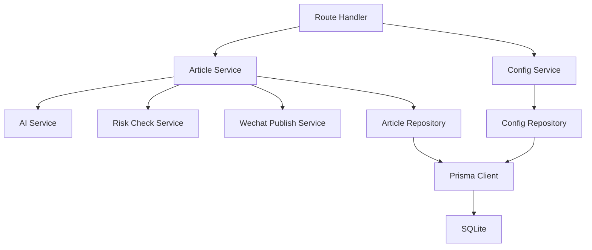
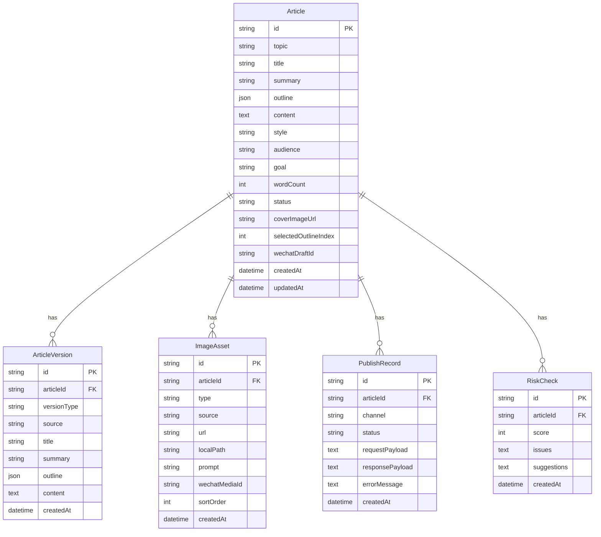

## 1. 架构设计


本项目采用前后端一体化架构，以 `Next.js` 作为单体应用承载 UI、接口和服务编排逻辑。这样可以用最少的工程复杂度，支撑个人版 MVP 快速迭代，并保留后续独立拆分后端的可能。

## 2. 技术描述
- 前端：`Next.js 15` + `React 19` + `TypeScript` + `Tailwind CSS`
- 后端接口：`Next.js Route Handlers`
- 数据访问：`Prisma`
- 数据库：`SQLite`（MVP 阶段），后续可迁移到 `PostgreSQL`
- 数据校验：`zod`
- 状态与请求：首版使用原生 `fetch`，后续可引入 `React Query`
- 富文本策略：MVP 先用轻量编辑器或 `textarea`，确保先打通链路
- 图片存储：本地文件或对象存储二选一，MVP 可先本地保存
- 外部依赖：
  - 文本生成模型：用于大纲、正文、标题、摘要生成
  - 图片生成模型：用于封面图与插图生成
  - 微信公众号接口：用于上传素材、创建草稿、更新草稿

## 3. 路由定义
| 路由 | 用途 |
|------|------|
| `/` | 工作台首页，创建文章任务并进入生成流程 |
| `/articles/[id]` | 文章编辑页，完成大纲选择、正文编辑、封面图与推送 |
| `/history` | 历史文章列表页，查看与复用旧文章 |
| `/settings` | 系统设置页，配置公众号与模型参数 |

## 4. API 定义
### 4.1 TypeScript 类型定义
```ts
export type ArticleStatus =
  | "draft"
  | "outlined"
  | "generated"
  | "edited"
  | "checked"
  | "pushed"
  | "failed";

export type OutlineSection = {
  heading: string;
  summary: string;
};

export type OutlineOption = {
  index: number;
  title: string;
  positioning: string;
  sections: OutlineSection[];
};

export type ApiResponse<T> = {
  code: number;
  message: string;
  data: T;
};
```

### 4.2 接口清单
| 方法 | 路径 | 用途 |
|------|------|------|
| `POST` | `/api/articles` | 创建文章任务 |
| `GET` | `/api/articles` | 获取历史文章列表 |
| `GET` | `/api/articles/:id` | 获取文章详情 |
| `PUT` | `/api/articles/:id` | 保存文章编辑结果 |
| `POST` | `/api/articles/:id/generate-outline` | 生成大纲方案 |
| `POST` | `/api/articles/:id/select-outline` | 确认选择的大纲 |
| `POST` | `/api/articles/:id/generate-content` | 基于大纲生成正文 |
| `POST` | `/api/articles/:id/generate-summary` | 生成摘要和封面短文案 |
| `POST` | `/api/articles/:id/generate-titles` | 生成备选标题 |
| `POST` | `/api/articles/:id/risk-check` | 运行内容风险检测 |
| `POST` | `/api/articles/:id/push-draft` | 推送到公众号草稿箱 |
| `GET` | `/api/configs` | 获取系统配置 |
| `PUT` | `/api/configs` | 更新系统配置 |

### 4.3 核心请求与响应示例
#### 创建文章
```ts
type CreateArticleRequest = {
  topic: string;
  keywords?: string;
  style?: string;
  wordCount?: number;
  audience?: string;
  goal?: string;
};

type CreateArticleResponse = ApiResponse<{
  id: string;
  status: "draft";
}>;
```

#### 生成大纲
```ts
type GenerateOutlineResponse = ApiResponse<{
  outlines: OutlineOption[];
}>;
```

#### 生成正文
```ts
type GenerateContentResponse = ApiResponse<{
  id: string;
  title: string | null;
  summary: string | null;
  content: string | null;
  status: "generated";
}>;
```

#### 风险检测
```ts
type RiskCheckResponse = ApiResponse<{
  score: number;
  issues: string[];
  suggestions: string[];
}>;
```

#### 推送草稿
```ts
type PushDraftResponse = ApiResponse<{
  wechatDraftId: string;
  status: "pushed" | "failed";
}>;
```

## 5. 服务端架构图


### 5.1 分层职责
- `Route Handler`：接收请求、校验参数、组织响应结构。
- `Article Service`：编排生成、编辑、检测、发布等业务流程。
- `AI Service`：统一封装大纲、正文、标题、摘要、图片提示词生成。
- `Risk Check Service`：执行敏感词、夸张表述、可读性等规则检测。
- `Wechat Publish Service`：统一封装公众号素材上传与草稿推送逻辑。
- `Repository`：隔离 Prisma 细节，便于后续替换数据库或做测试。

## 6. 数据模型
### 6.1 数据模型定义


### 6.2 数据定义语言
```sql
CREATE TABLE articles (
  id TEXT PRIMARY KEY,
  topic TEXT NOT NULL,
  keywords TEXT,
  title TEXT,
  subtitle TEXT,
  summary TEXT,
  outline JSON,
  content TEXT,
  style TEXT,
  audience TEXT,
  goal TEXT,
  word_count INTEGER,
  status TEXT NOT NULL DEFAULT 'draft',
  cover_image_url TEXT,
  selected_outline_index INTEGER,
  wechat_draft_id TEXT,
  created_at DATETIME NOT NULL DEFAULT CURRENT_TIMESTAMP,
  updated_at DATETIME NOT NULL DEFAULT CURRENT_TIMESTAMP
);

CREATE TABLE article_versions (
  id TEXT PRIMARY KEY,
  article_id TEXT NOT NULL,
  version_type TEXT NOT NULL,
  source TEXT NOT NULL DEFAULT 'ai',
  title TEXT,
  summary TEXT,
  outline JSON,
  content TEXT,
  created_at DATETIME NOT NULL DEFAULT CURRENT_TIMESTAMP,
  FOREIGN KEY(article_id) REFERENCES articles(id) ON DELETE CASCADE
);

CREATE INDEX idx_article_versions_article_id
ON article_versions(article_id);

CREATE TABLE image_assets (
  id TEXT PRIMARY KEY,
  article_id TEXT NOT NULL,
  type TEXT NOT NULL,
  source TEXT NOT NULL,
  url TEXT,
  local_path TEXT,
  prompt TEXT,
  wechat_media_id TEXT,
  sort_order INTEGER NOT NULL DEFAULT 0,
  created_at DATETIME NOT NULL DEFAULT CURRENT_TIMESTAMP,
  FOREIGN KEY(article_id) REFERENCES articles(id) ON DELETE CASCADE
);

CREATE INDEX idx_image_assets_article_id
ON image_assets(article_id);

CREATE TABLE publish_records (
  id TEXT PRIMARY KEY,
  article_id TEXT NOT NULL,
  channel TEXT NOT NULL DEFAULT 'wechat',
  status TEXT NOT NULL DEFAULT 'pending',
  request_payload TEXT,
  response_payload TEXT,
  error_message TEXT,
  created_at DATETIME NOT NULL DEFAULT CURRENT_TIMESTAMP,
  FOREIGN KEY(article_id) REFERENCES articles(id) ON DELETE CASCADE
);

CREATE INDEX idx_publish_records_article_id
ON publish_records(article_id);

CREATE TABLE risk_checks (
  id TEXT PRIMARY KEY,
  article_id TEXT NOT NULL,
  score INTEGER,
  issues TEXT,
  suggestions TEXT,
  created_at DATETIME NOT NULL DEFAULT CURRENT_TIMESTAMP,
  FOREIGN KEY(article_id) REFERENCES articles(id) ON DELETE CASCADE
);

CREATE INDEX idx_risk_checks_article_id
ON risk_checks(article_id);

CREATE TABLE app_configs (
  id TEXT PRIMARY KEY,
  config_key TEXT NOT NULL UNIQUE,
  config_value TEXT NOT NULL,
  created_at DATETIME NOT NULL DEFAULT CURRENT_TIMESTAMP,
  updated_at DATETIME NOT NULL DEFAULT CURRENT_TIMESTAMP
);
```

## 7. 开发约束与实施顺序
- 第一步：打通 `创建文章 -> 生成大纲 -> 选择大纲 -> 生成正文 -> 保存草稿`。
- 第二步：补齐 `摘要生成`、`标题生成`、`风险检测`。
- 第三步：接入 `微信公众号素材上传` 与 `草稿箱推送`。
- 第四步：补充 `历史记录`、`设置页` 和轻量封面图能力。
- 默认采用人工确认后发布策略，不实现无人审核自动群发。
